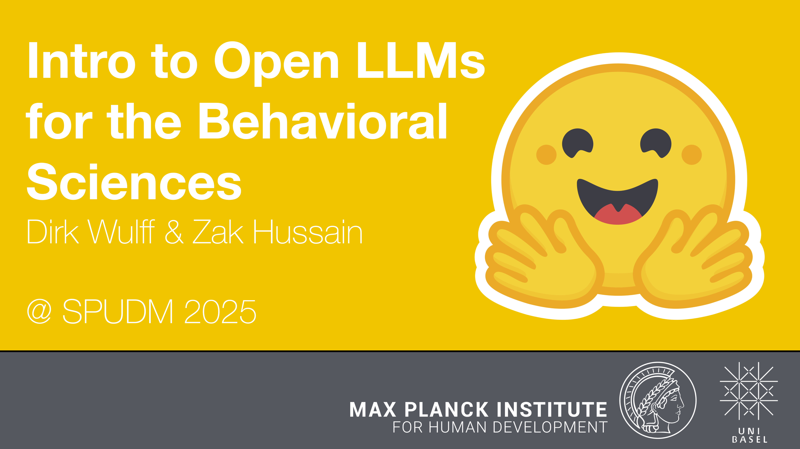

## LLM4BeSci at SPUDM, Lucca 2025



The course introduces the use of open-source large language models (LLMs) from the Hugging Face ecosystem for research in the behavioral and social sciences. Materials will be uploaded shortly before the start of the course.

By [Dirk Wulff](https://www.mpib-berlin.mpg.de/person/93374/2549) and [Zak Hussain](https://zak-hussain.github.io/)

### Schedule

#### Day 1
<font style="font-size:10">09:30 AM - 09:45 AM: Welcome & Intro<br>
09:45 AM - 10:45 AM: [Talk: Intro to LLMs](day_1/day_1a.pdf)<br>
10:45 AM - 11:00 AM: Break<br>
11:00 AM - 11:45 AM: Discussion: Find applications in small groups<br>
11:45 AM - 12:30 PM: [Talk: A gentle intro to Hugging Face and Python](day_1/day_1b.pdf)<br>
12:30 PM - 02:00 PM: Lunch<br>
02:00 PM - 02:15 PM: Setup Colab<br>
02:15 PM - 03:00 PM: [Exercise: Running pipelines](day_1/day_1.ipynb)<br>
03:00 PM - 03:15 PM: Walkthrough<br>
03:15 PM - 03:30 PM: Break<br>
03:30 AM - 04:30 AM: [Talk: Intro to transformers & embeddings](day_2/day_2.pdf)<br>
04:30 PM - 05:00 PM: Open questions<br>

#### Day 2
09:30 AM - 10:00 AM: Recap quiz<br>
10:00 AM - 11:00 AM: [Talk: Intro to transformers & embeddings (continued)](day_2/day_2.pdf)<br>
11:00 AM - 11:15 AM: Break<br>
11:15 AM - 12:00 AM: [Exercise: Clarifying self-reports](day_2/day_2.ipynb)<br>
12:00 PM - 12:30 PM: Walkthrough<br>
12:30 PM - 02:00 PM: Lunch<br>
02:00 PM - 03:00 PM: Discussion: Find applications in small groups<br>
03:00 PM - 03:30 PM: Break<br>
03:30 PM - 04:30 PM: [Intro to textgen](day_3/day_3.pdf)<br>
04:30 PM - 05:00 PM: Open questions<br>

#### Day 3
09:30 AM - 10:00 AM: Recap quiz<br>
10:00 AM - 11:00 AM: [Exercise: Classifying media bias w/ zero & few-shot](day_3/day_3a.ipynb)<br>
11:00 AM - 11:30 AM: Walkthrough<br>
11:30 PM - 11:45 PM: Break<br>
11:45 PM - 12:30 PM: Discussion: Find applications in small groups<br>

### Resources
<a href="https://doi.org/10.3758/s13428-024-02455-8">Hussain, Binz, Mata, & Wulff (2024). A tutorial on open-source large language models for behavioral science. *Behavior Research Methods*, 1-24.
</a>
```
@article{hussain2024tutorial,
  title={A tutorial on open-source large language models for behavioral science},
  author={Hussain, Zak and Binz, Marcel and Mata, Rui and Wulff, Dirk U},
  journal={Behavior Research Methods},
  pages={1--24},
  year={2024},
  publisher={Springer}
}
```

<a href="https://osf.io/preprints/osf/ybvzs_v1">Wulff, Hussain, & Mata (2024). The behavioral and social sciences need open LLMs
. *OSF preprint*.
</a>
```
@article{wulff2024openllms,
  title={The behavioral and social sciences need open LLMs},
  author={Wulff, Dirk U and Hussain, Zak and Mata, Rui},
  journal={OSF},
  year={2024}
}
```

[Hugging face documentation](https://huggingface.co/docs)<br>
[Hugging face book](https://transformersbook.com/)<br>
[But what is a GPT (3Blue1Brown)](https://www.youtube.com/watch?v=wjZofJX0v4M&list=PLZHQObOWTQDNU6R1_67000Dx_ZCJB-3pi&index=5)<br>

### Installation Instructions

#### Hugging Face and Meta Llama License
1. Make sure you have a hugging Face account (https://huggingface.co/join).
2. Go to the [`meta-llama/Llama-3.2-3B-Instruct` model page](https://huggingface.co/meta-llama/Llama-3.2-3B-Instruct) and fill in the 'COMMUNITY LICENSE AGREEMENT' form at the top of the page to get access to the model (this may take a day or so).
3. Once you have been granted access to the model, you can navigate to [your Hugging Face profile settings](https://huggingface.co/settings/tokens) to generate an API token (+Create new token). Set the token type to 'Read' and give it a name (e.g., 'LLM4BeSci_Ljubljana2025').

#### Google Colab and GitHub Repository
4. If you do not have a Google account, you will need to create one (this can be deleted after the workshop).
5. Navigate to Google Drive (https://drive.google.com/).
6. In the top-left, click New > More > Colaboratory. If you do not see Colaboratory, you may need to click "Connect more apps", 
search for 'Colaboratory', and install it. Then click New > More > Colaboratory.
7. Copy the following code snipped into the first cell of the notebook. Run it (```shift + enter``` or click &#9658; button) to mount your Google Drive to the Colab environment.
A pop-up will ask you to connect; click through the steps to connect your Google Drive to Colab (you will have to do this
every time you open a new notebook).
```
from google.colab import drive
drive.mount("/content/drive")
```
8. Create a second cell in your notebook using the "+ Code" button that appears when you hover your cursor right under the first cell. Copy and run the following code snippet in the second cell of your notebook to clone the GitHub repository to your Google Drive :
```
%cd /content/drive/MyDrive
!git clone https://github.com/dwulff/LLM4BeSci_SPUDM25
```
9. Go back to your Google Drive and navigate to the folder "LLM4BeSci_Ljubljana2025". You should see the directories `day_1`, `day_2`,`day_3`, `day_4`, and `day_5` containing the relevant notebooks (.ipynb files) and data (it may take  a couple of minutes for the files to appear) for the exercises of each day.

You have now successfully set up your Google Colab environment and cloned the GitHub repository! 

You are now ready to work through all the exercises in the course! 
